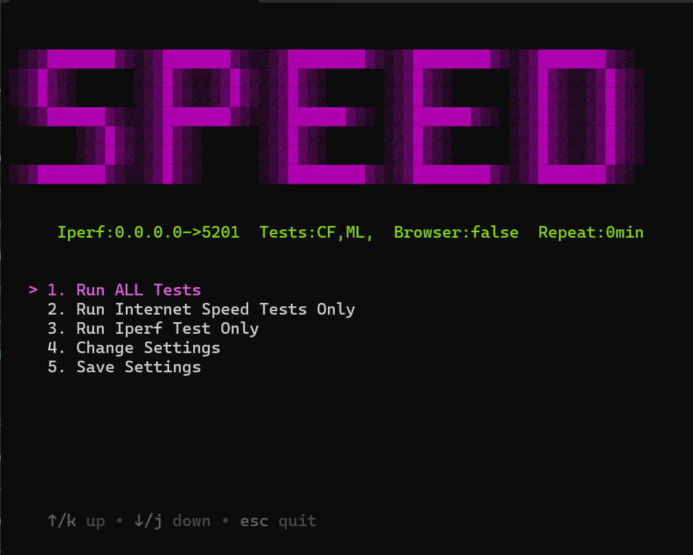
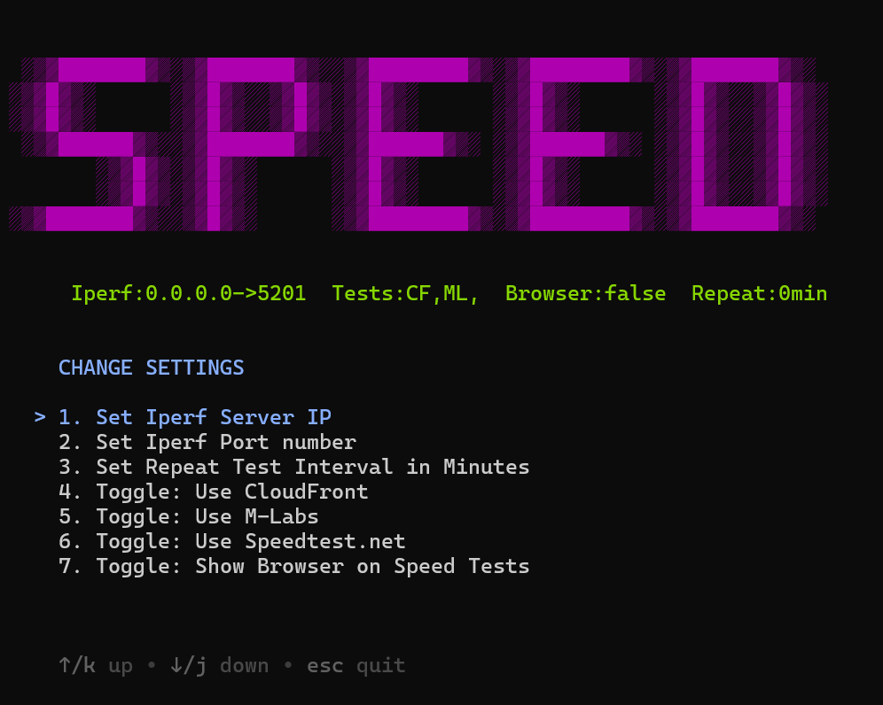

# Speed Tests

A self running app that performs network bandwidth speed test.

It uses [speedtest.net](https://www.speedtest.net/), [Cloud Flare](https://speed.cloudflare.com/) and [MLabs](https://speed.measurementlab.net/#/) for the Internet test. It uses [Iperf 3.0](https://iperf.fr/iperf-download.php) for the direct server test.

## Features
- Allows you to run Iperf tests on multiple clients simultaneously to just one Iperf3 server.
- Allows you to run multiple Internet speed test for comparison.
- Runs consistenly at whatever interval times you desire (0 min is the default meaning run ONCE).
- Saves the result to a log file in the same location as the executable for documentation.
- Runs Internet speed test on each pass to document client host bandwidth when performing the iper3 test.
- Options you can change: 
    - Port number of the Iperf server
    - Repeat test time interval
    - MSS segment size for advanced LAN testing with Iperf3
    - Perform Internet test while viewing the result directly from testing website

## How to Run
- Setup iperf on a remote server. Default port is 5201. use *-p portnumber* to change.
```
sudo apt install iperf3
iperf3 -s -p 5201
```

- Run latest .exe release
- **Option 1**: to run All tests. Internet Speed test and Iperf3.
- **Option 2**: Internet speeds tests only.
- **Option 3**: Iperf test only.
- **Option 4**: Change additional settings as shown in green above.
- **Option 5**: Saves your config to a settings.json file. Keep that file present in the same directory to use the same settings. Great for sharing in networks.




## Troubleshoot

If you are running this behind a firewall or an internal proxy that blocks direct access to the public resources then you will see this error:

```
Error: self signed certificate in certificate chain
```

This occurs becuase during the Internet Speed test chromium files are needed and downloaded from the Microsoft CDN. The requests of the proxy get intercepted with a custom untrusted certificate authority (CA) and it yields the above error. To remedy this add a copy of your custom root certificate (cert.pem) for your proxy server in the same directory as this executable. When you run the Internet Speed Test it will scan if a *.pem file is located in the same directory and give you the option to use before running the test.

## Settings

