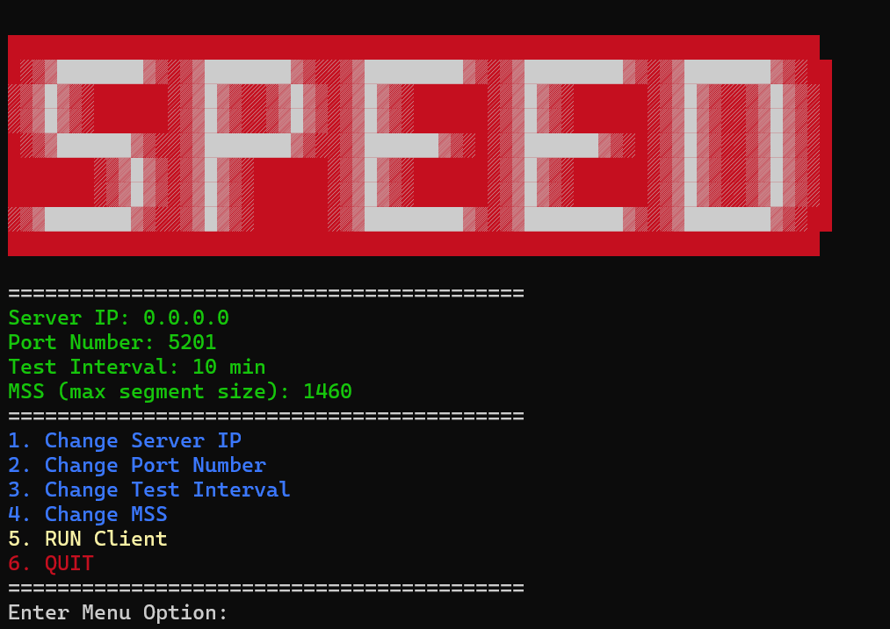

# Speed Test with Iperf3

This is a self running app that runs speed tests using [Iperf 3.0](https://iperf.fr/iperf-download.php)

It does the following:
- Allows you to run iperf tests on on multiple clients with just one iperf3 server.
- Runs consistenly at whatever interval times you desire (10 min is the default).
- Saves the result to a log file in the same location as the executable for documentation.
- Options you can change: 
    - Port number of the server
    - Frequency time interval
    - MSS segment size for advanced testing



## How to Run
- Setup iperf on a remote server. Default port is 5201. use *-p portnumber* to change.
```
sudo apt install iperf3
iperf3 -s -p 5201
```

- Run latest .exe release
- Choose **Option 1**: to enter Server IP address
- Choose **Option 5**: to Run the test with default settings

