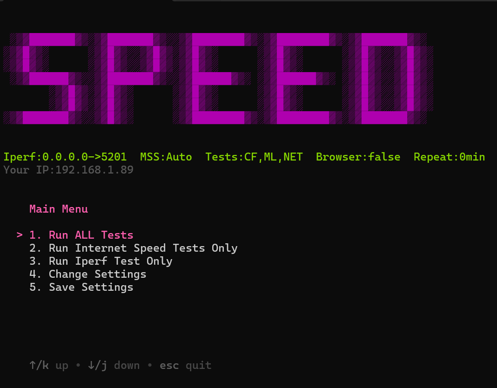

# Speed Tests

A self running app that performs network bandwidth speed test.

It uses [speedtest.net](https://www.speedtest.net/), [Cloud Flare](https://speed.cloudflare.com/) and [MLabs](https://speed.measurementlab.net/#/) for the Internet test. For the direct server test [Iperf 3.0](https://iperf.fr/iperf-download.php) is used.

## Features
- Run Iperf tests on multiple clients simultaneously to just one Iperf3 server.
- Run multiple Internet speed tests for comparison.
- Repeat tests consistenly at minute interval times (0 min is the default meaning run ONCE).
- Saves the result to a log file in the same location as the executable for documentation.
- Run All tests together or seperately as one time test or on continuous interval.
- Allows you to save a congifuration file to distribute settings to other users.
- Send e-mail of test results to desired e-mail recipient using direct SMTP or plug into Outlook desktop.
- Options you can change:

    - Port number of the Iperf server
    - Repeat test time interval
    - MSS segment size for advanced LAN testing with Iperf3
    - View browser with Cloudflare & MLabs speed test
    - Custom Email settings

## How to Run

- Setup iperf on a remote server. Default port is 5201. use *-p portnumber* to change
- On server:

```
sudo apt install iperf3
iperf3 -s -p 5201
```

- On Client: Run latest .exe release
    - **Option 1**: Run All tests. Selected Internet Speed Tests and Iperf3.
    - **Option 2**: Internet speeds tests only.
    - **Option 3**: Iperf test only.
    - **Option 4**: Change additional settings which are shown green in the toolbar.
    - **Option 5**: Save configuration as 'settings.json' in current directory.




## Troubleshoot

If you are running this behind a firewall or an internal proxy that blocks direct access to the public resources then you will see one or all of these errors:

```
Error Installing Components need for Tests. Internet is inaccessible:
Error: self signed certificate in certificate chain. 
Error: unable to get local issuer certificate
code: 'UNABLE_TO_GET_ISSUER_CERT_LOCALLY'
```

This occurs becuase during the Internet Speed test chromium files are needed and downloaded from the Microsoft CDN. This is a one time download but is needed for the Internet speed tests. The requests get intercepted with a custom untrusted certificate authority (CA) and it yields the above error. To fix this add a copy of your custom root certificate (cert.pem) that verifies your proxy server in the same directory as this executable.
